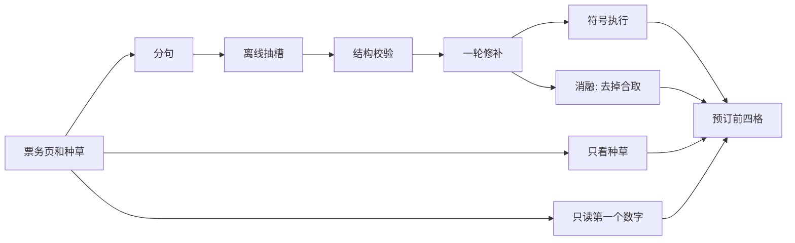

# 数据流

参照的是 [ChinaTravel](https://github.com/LAMDA-NeSy/ChinaTravel) 的神经符号做法，不是它的行程规划器。那条线把自然语言收成可执行约束，再用符号程序判定；纯读模型在合取约束上会失败。规则卡只借用这个分工：散文提议结构，结构校验通过后才执行。

| 步骤 | 做什么 | 失败时 |
|---|---|---|
| 分句 | 标出票种、放票、优惠、在售 | 没写数字的句子标成噪声 |
| 抽槽 | 身高带、年龄带、含不含边界、放票钟点、套票、互斥 | 口语和厘米先换成米 |
| 校验 | 判定方式必须是四种之一；免票线不能高于半票线 | 不合规则不执行残缺结构 |
| 修补 | 只对调写反的身高界，或按「且 / 二选一」改正判定方式 | 不编造页面里没有的数字 |
| 执行 | 只吃结构，输出免票 / 半票 / 全票，并带回触发句 | 合取时任一侧不够就全票 |
| 对照 | 种草词、首个数、去掉合取，三路和执行比 | 错因分成种草冲突、双门槛、仅售套票、没有门槛 |

可选模型：环境变量 `RULECARD_LLM_BASE`、`RULECARD_LLM_KEY`、`RULECARD_LLM_MODEL` 都在时，才向兼容接口要一份 JSON。过不了校验就丢掉。执行始终用离线抽取，避免现场没网时演示停住。
